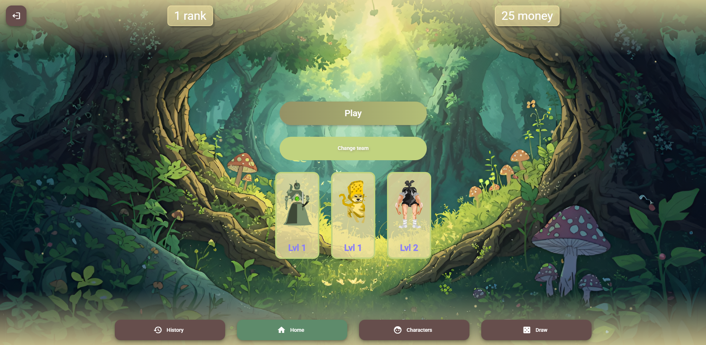
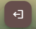
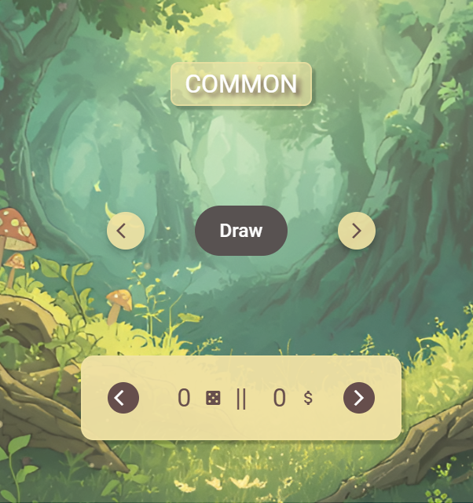
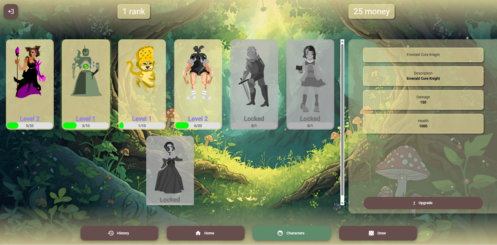
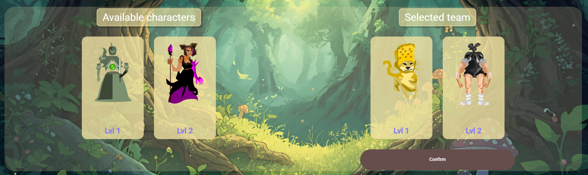
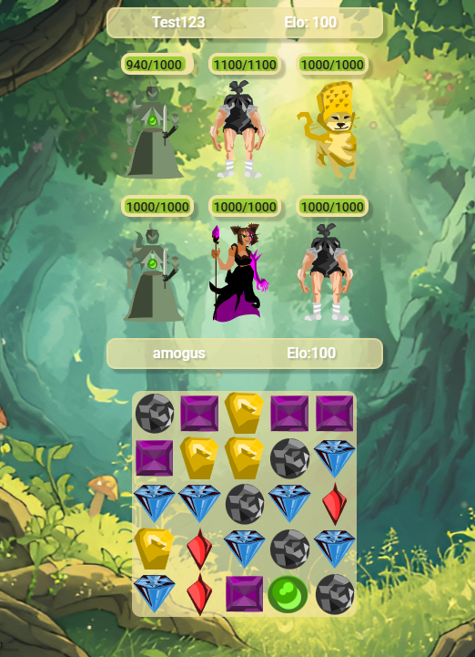

# Początkowe założenia projektu

W ramach projektu stworzymy grę, w której użytkownik będzie mógł losować postacie i używać ich do rywalizacji z innymi graczami, lub ewentualnie do samodzielnej gry. Rywalizację graczy planujemy zrealizować w formie rozgrywek typu match 3. Przewidujemy stworzenie możliwości rejestracji użytkowników, przechowywania danych o tym jakie postacie posiadają, oraz zapisywać rezultaty rozgrywek. Na podstawie rezulatów rozgrywek, statystyk gracza stworzone będą rankingi, albo będzie możliwość przeglądania historii wyników rozgrywek.

# Realizacja

Projekt Zrealizowaliśmy używając Spring Boota i Angulara.

# Skład zespołu

Norbert Drabiński, Szymon Mucha, Kacper Skrodzki, Wiktoria Parzych

# Link do dokumentacji technicznej

# Dokumentacja dla użytkownika

## Uruchamianie programu

Aby uruchomić program trzeba jednocześnie uruchomić serwer backendu i frontend. W projekcie używamy Javy w wersji 24 i Angulara w wersji 20, a więc aby używać aplikację należy mieć JDK Javy 24, zainstalowanego Node.js. Frtontend uruchamia się używając komendy:

> npm install

> ng s

będąc w folderze frontend. Przy kolejnych uruchomieniach można używać samej komendy ng s.

Backend uruchamia się będąc w folderze backend.Zaleca się użycie środowiska programistycznego takiego jak IntelliJ IDEA w celu łatwiejszego uruchomienia projektu.
Po otwarciu projektu w IntelliJ IDEA i kliknięciu 'run' środowisko automatycznie:

- buduje projekt przy użyciu Gradle,
- pobiera i konfiguruje wszystkie wymagane zależności,
- ustawia odpowiedni classpath,
- uruchamia metodę `main` klasy `Application`
  Gradle można zbudować także komendą
  > ./gradlew build

Po uruchomieniu frontendu i backendu należy wejść na adress http://localhost:4200/ w przeglądarce.

## Logowanie i zakładanie konta

Po wejściu na podany adres, użytkownik zostaje przekierowany do http://localhost:4200/auth/login. Jeśli użytkownik nie ma konta może je zalożyć klikając link 'Sign Up'. Podczas rejestracji użytkownik musi podać swojego maila oraz nazwę użytkownika. Nazwy użytkownika są unikalne w ramach gry - więcej niż dwóch użytkowników nie może mieć danej nazwy.

## Ekran główny

Po zalogowaniu użytkownik przenoszony jest na http://localhost:4200/main/home. Aby przejść do ekranu domowego użytkownik musi wybrać guzik home na dole ekranu.

Na górze ekranu głównego użytkownik widzi swoją ilość pieniędzy oraz pozycję w rankingu.
Guzik

pozwala na wylogowanie użytkownika i przenosi go z powrotem na ekran logowania.

### Losowanie i ulepszanie posatci

Guzik Draw przenosi użytkownika do ekranu losowania postaci.

Guziki strzałek na żółtym panelu służą do zmieniania ilości postaci, które będą wylosowane naraz. Guziki przy napisie Draw służą do zmieniania typu losowania. Istnieją trzy typy losowania: COMMON, UNCOMMON i RARE. Zmieniają one prawdopodobieństwo, z jakim będą wylosowane poszczególne postacie. Po kliknięciu przycisku draw uruchamia się animacja losowania i użytkownik jest poinformowany o tym jakie postacie zdobył.

Po kliknięciu na guzik characters na ekranie domowym użytkownik jest przeniesiony do ekranu, w którym ma możliwość ulepszania swoich postaci i zobaczenia ich statystyk.

Po kliknięciu na daną postać możemy zobaczyć jej dane. Pod każdą postacią wyświetlany pasek oznacza ilość posiadanych kopii danej postaci. Kopie postaci możemy uzyskać z losowania. Aby ulepszyć postać należy mieć określoną na pasku ilość kopii postaci. Ulepszanie postaci zwiększa jej zdrowie i damage.

### Wybieranie postaci

Postacie używane są podczas rozgrywki. Aby rozpocząć rozgrywkę trzeba posiadać przynajmniej 3 postacie i dodać je do swojej aktywnej dróżyny. Aby dokonać zmian w aktualnej drużynie trzeba kliknąć guzik 'Change Team' na ekranie domowym. Na wyświetlonym ekranie trzeba przeciągnąć postacie z tych po lewej - available characters, na prawo. Aby potwierdzić trzeba przeciągnąć dokładnie 3 postacie, które będą częścią drużyny.

Po wybraniu postaci do drużyny są one wyświetlane na ekranie domowym pod przyciskiem play.

### Ranking i historia gry

Po kliknięciu na guzik history użytkownik ma możliwość zobaczenia swojego elo, liczby zwycięstw i przegranych, a także wpisów z poszczególnych rozgrywek mówiących o ich wyniku i o danych przeciwnika. Ranking można zobaczyć klikając na swoją rangę na ekranie domowym. Wyświetlona jest wtedy lista graczy wraz z ich pozycją w rankingu i elo. Po kliknięciu na danego gracza w rankingu można zobaczyć jego historię rozgrywki.

## Rozgrywka

### Jak uruchomić rozgrywkę

Aby uruchomić rozgrywkę trzeba najpierw wybrać drużynę składającą się z 3 postaci. Następnie z ekranu domowego kliknąć guzik play. Po kliknięciu guzika użytkownik zostanie umieszczony w kolejce, w której będzie czekał na dołączenie innych graczy chcących zagrać. Po pojawieniu się innego gracza zostaje stworzona gra. Podczas odpalania gry samodzielnie, bez innych graczy, można otworzyć nowe okno incognito przeglądarki i zalogować się na inne konto. Na tym koncie trzeba także wylosować postacie i wybrać drużynę.

### Zasady gry

Po uruchomieniu rozgrywki widoczna jest plansza, postacie gracza i postacie przeciwnika. Postacie gracza, wraz z jego nazwą użytkownika i elo pokazane są bliżej planszy, a postacie przeciwnika dalej od niej. Nad każdą postacią widznieje pasek oznaczający liczbę jej zdrowia.

Gracz którego tura jest aktualnie, przeciąga kryształki na planszy zamieniając je. Musi on dopasować conajmniej 3 kryształki, aby wykonać ruch. Po wykonaniu ruchu postacie gracza zadają damage. Postacią, która przyjmuje damage w grze jest zawsze pierwsza postać w kolejności od lewej z postaci przeciwnika. Obrażenia jakie zadaje postać zależą od wartości jej damage-u i od koloru dopasowanych kryształków. Postacie mają przypisane kolor kryształka, bądź ilość kombinacji różnych kolorów kryształków, przy których zadają większy damage. Postać, której zdrowie spadło do 0 nie przyjmuje obrażeń i nie zadaje ich. Po spadku zdrowia pierwszej z kolei postaci przeciwnika do 0, atakowana jest kolejna postać z kolei. Gracz przegrywa kiedy zdrowie wszystkich jego postaci spadnie do 0. Po zakończeniu rozgrywki gracze otrzymują walutę i zmienia się ich elo, a rozgrywka zapisywana jest do ich historii rozgrywek.

Jeśli któryś z graczy chwilowo rozłączy się, to po kliknięciu guzika play z ekranu głownego zostanie dołączony do gry, w której uczestniczył przedtem.
